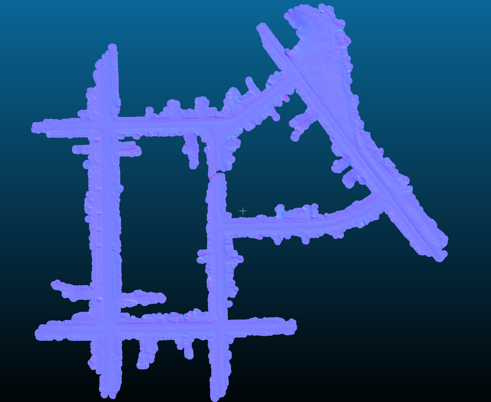
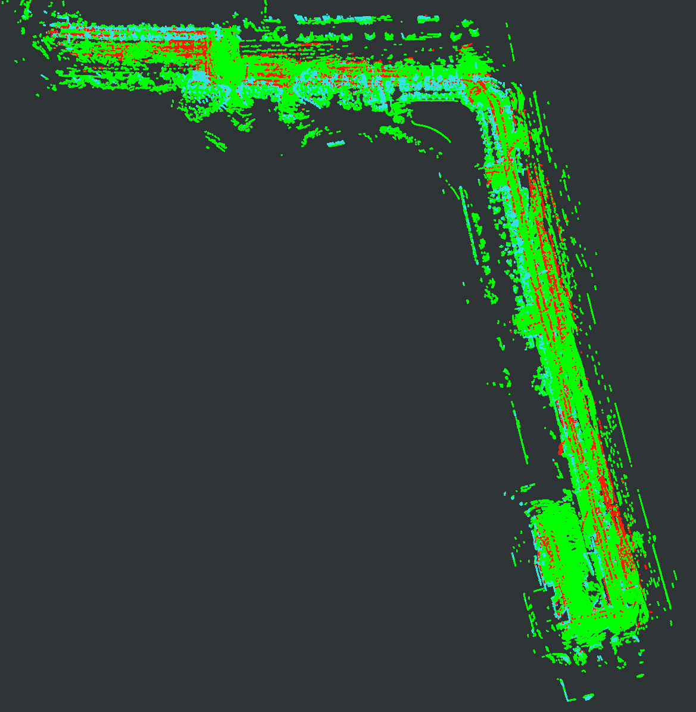
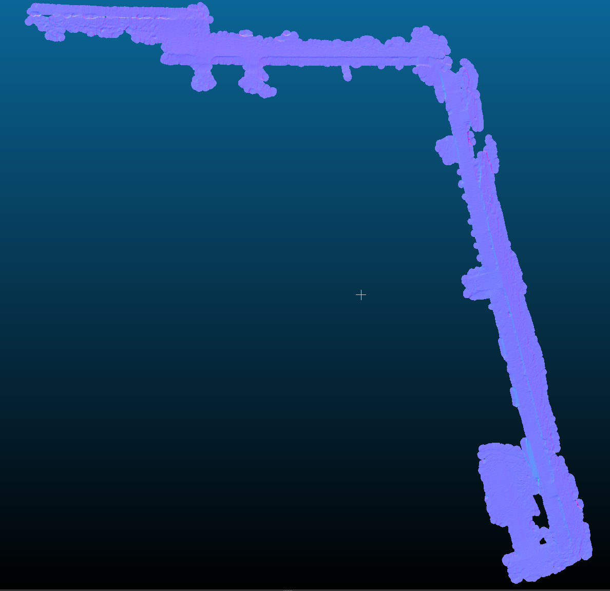

# MapCleaner Unofficial
- This repository is an unofficial implementation of "[MapCleaner](https://www.mdpi.com/2072-4292/14/18/4496)", a method for removing moving objects from point cloud maps.
- Please note that I created this software as a hobby and there is no guarantee that the contents of the paper are accurately implemented.

<center></center>

##### KITTI Odometry 07
|Result|Terrain|
|----|----|
|||

##### ERASOR bongeunsa_dataset
|Result|Terrain|
|----|----|
|||


### Env
- Ubuntu 20.04 LTS
- ROS Noetic

### How to build
- Dependencies
```
sudo apt install ros-noetic-grid-map ros-noetic-pcl-ros
```
- Build
```
mkdir -p catkin_ws/src
cd catkin_ws/src
git clone "this repo" src
catkin_make
```

### How to use
1. Open `config/config.yaml`or`config/config_kitti.yaml`.
2. Change the following part of the opened yaml.
```
loader:
  pcds_dir: "[Directory path containing LiDAR scan frames]"
  pose_file: "[File path of pose data]"
  kitti_calibration_file: "[File path of KITTI calibration data]"
  start: [Start frame number]
  end: [End frame number] #If you set a negative value, it will be processed until the end.
  format: "[Dataset format]" #Please specify "kitti" or "erasor"

map_cleaner:
  save_dir: "[Directory path where results are saved]"
```
3. Run with the following command.
```
source devel/setup.bash
```
```
roslaunch map_cleaner run.launch
or
roslaunch map_cleaner run_kitti.launch
```
4. `ground.pcd, static.pcd, dynamic.pcd, ground_below, other.pcd, terrain.pcd` are output to the directory specified by `save_dir`.

*1: `other.pcd` contains the unprocessed point clouds that are not on the terrain model. If `divide_by_terrain/on_terrain_only` is `false`, all point clouds are processed. Therefore, `other.pcd` will not be output.  
*2: TRAVEL parameters are located in `thirdparty/travel/config`.

### Dataset
- I recommend using [SemanticKITTI's Pose data](http://www.semantic-kitti.org/index.html) because the Pose data of KITTI Odometry is not accurate.
- In addition to the KITTI Odometry format, it also supports the data format indicated in the "In your own dataset" section of [ERASOR](https://github.com/LimHyungTae/ERASOR#in-your-own-dataset). Please refer to ERASOR's README for details.
- My other repository [SimpleLoopClosure](https://github.com/kamibukuro5656/SimpleLoopClosure) supports output in ERASOR format.

### Difference from paper
- In the paper, [Patchwork](https://github.com/LimHyungTae/patchwork) is used for the initial estimation of ground point clouds, but in this repository, [TRAVEL](https://github.com/url-kaist/TRAVEL) is used.
- A 3x3 Median Filter has been added after the second BGK Filter.
- The judgment condition of "Fused Result" is partially different from the pseudocode in the paper.

### Citation
- Original Paper
```
@Article{rs14184496,
    AUTHOR = {Fu, Hao and Xue, Hanzhang and Xie, Guanglei},
    TITLE = {MapCleaner: Efficiently Removing Moving Objects from Point Cloud Maps in Autonomous Driving Scenarios},
    JOURNAL = {Remote Sensing},
    VOLUME = {14},
    YEAR = {2022},
    NUMBER = {18},
    ARTICLE-NUMBER = {4496},
    URL = {https://www.mdpi.com/2072-4292/14/18/4496},
    DOI = {10.3390/rs14184496}
    }
```

- [TRAVEL](https://github.com/url-kaist/TRAVEL)
```
@ARTICLE{oh2022travel,  
    author={Oh, Minho and Jung, Euigon and Lim, Hyungtae and Song, Wonho and Hu, Sumin and Lee, Eungchang Mason and Park, Junghee and Kim, Jaekyung and Lee, Jangwoo and Myung, Hyun},  
    journal={IEEE Robotics and Automation Letters},   
    title={TRAVEL: Traversable Ground and Above-Ground Object Segmentation Using Graph Representation of 3D LiDAR Scans},   
    volume={7},  
    number={3},  
    pages={7255-7262},  
    year={2022},
    }
```
```
@article{lim2021patchwork,
    title={Patchwork: Concentric Zone-based Region-wise Ground Segmentation with Ground Likelihood Estimation Using a 3D LiDAR Sensor},
    author={Lim, Hyungtae and Minho, Oh and Myung, Hyun},
    journal={IEEE Robot. Autom. Lett.},
    volume={6},
    number={4},
    pages={6458--6465},
    year={2021},
    }
```
```
@article{lim2021erasor,
    title={ERASOR: Egocentric Ratio of Pseudo Occupancy-Based Dynamic Object Removal for Static 3D Point Cloud Map Building},
    author={Lim, Hyungtae and Hwang, Sungwon and Myung, Hyun},
    journal={IEEE Robotics and Automation Letters},
    volume={6},
    number={2},
    pages={2272--2279},
    year={2021},
    publisher={IEEE}
    }
```

- [Nanoflann](https://github.com/jlblancoc/nanoflann)
```
@misc{blanco2014nanoflann,
  title        = {nanoflann: a {C}++ header-only fork of {FLANN}, a library for Nearest Neighbor ({NN}) with KD-trees},
  author       = {Blanco, Jose Luis and Rai, Pranjal Kumar},
  howpublished = {\url{https://github.com/jlblancoc/nanoflann}},
  year         = {2014}
}
```